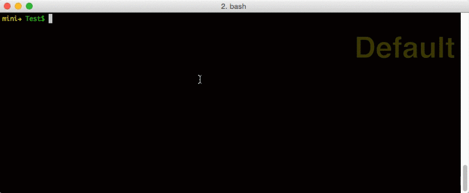

This project is based on https://github.com/lintingzhen/commitizen-go

Credits go to https://github.com/lintingzhen

# Commitizen-go
> Command line utility to standardize git commit messages, golang version.

Support git hooks



Contents
- Installation
- Usage
- Configure

## Installation

```
$ go install github.com/kitko/commitizen-go
```
### setup as git command

```
$ commitizen-go install
```
### setup as git hook

```
$ commitizen-go install-hook
```

### installation with source code as git command:
```
$ make && make install
```
or 
```
$ make && ./commitizen-go install
```
### installation with source code as git hook:
```
$ make && make install-hook
```
or 
```
$ make && ./commitizen-go install-hook
```

## Usage

### commit with commitizen as git command
```
$ git cz
```

### commit with commitizen as git hook
```
$ git commit
```

```
Usage:
  commitizen-go [flags]
  commitizen-go [command]

Available Commands:
  help        	Help about any command
  install     	Install this tool to git-core as git-cz
  install-hook 	Install this tool to ./git/hooks/prepare-commit-msg
  version     	Print version information and quit

Flags:
  -a, --all     tell the command to automatically stage files that have been modified and deleted, but new files you have not told Git about are not affected
  -d, --debug   debug mode, output debug info to debug.log
  -h, --help    help for commitizen-go
      --hook    tell the command to save message to .git/COMMIT_EDITMSG file

Use "commitizen-go [command] --help" for more information about a command.
```

## Configure
You can customize your commit type, items, and how to assemble these items through the configuration file.
Configuration file path is `~/.git-czrc`, and the format is the same as the defaultConfig string in the file commit/defaultConfig.go.
Type item like that:
```
...
{
	"name": "type",
	"desc": "Select the type of change that you're committing:",
	"form": "select",
	"options": [
		{ "name": "feat", "desc": "feat: A new feature" },
		{ "name": "fix", "desc": "fix: A bug fix" },
		{ "name": "docs", "desc": "docs: Documentation only changes" },
		{
		  "name": "style",
		  "desc":
			"style: Changes that do not affect the meaning of the code\n            (white-space, formatting, missing semi-colons, etc)"
		},
		{
		  "name": "refactor",
		  "desc": "refactor: A code change that neither fixes a bug nor adds a feature"
		},
		{
		  "name": "perf",
		  "desc": "perf: A code change that improves performance"
		},
		{ "name": "test", "desc": "test: Adding missing tests" },
		{
		  "name": "chore",
		  "desc":
			"chore: Changes to the build process or auxiliary tools\n            and libraries such as documentation generation"
		},
		{ "name": "revert", "desc": "revert: Revert to a commit" },
		{ "name": "WIP", "desc": "WIP: Work in progress" }
	],
	"required": true
},
...
```
Template like that:
```
...
"template": "{{.type}}{{with .scope}}({{.}}){{end}}: {{.subject}}{{with .body}}\n\n{{.}}{{end}}{{with .footer}}\n\n{{.}}{{end}}"
...
```
